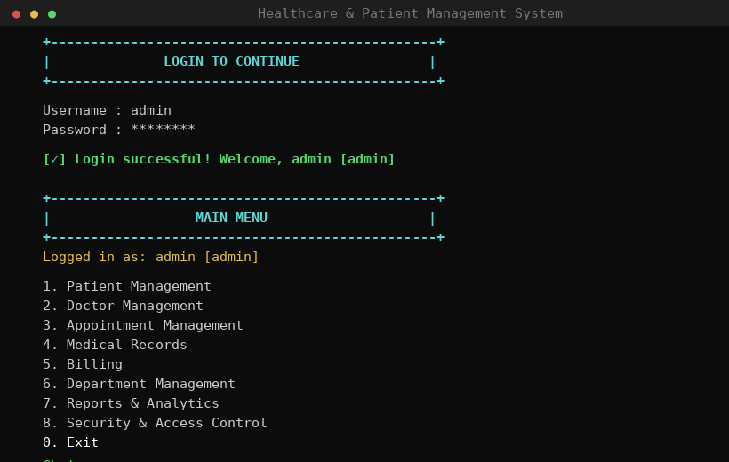
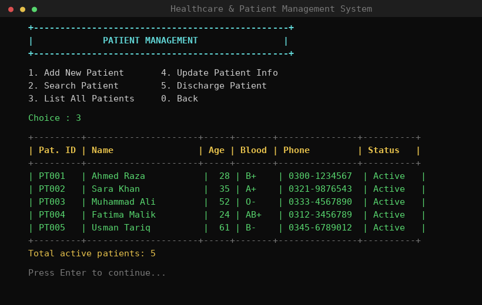
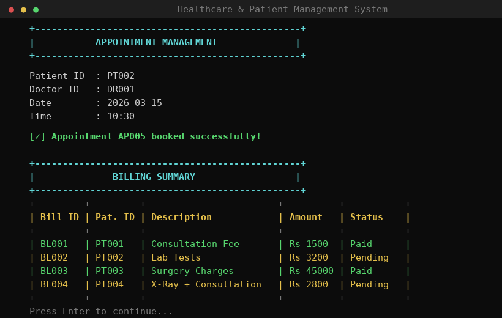

# 🏥 Healthcare & Patient Management System

A console-based Hospital Management System built in C++ using Object-Oriented Programming principles. It simulates a real hospital workflow with role-based access control, patient records, doctor scheduling, appointments, billing, and more — all from the terminal.

---

## Features

- 👤 **Patient Management** — Add, search, update, and discharge patients
- 🩺 **Doctor Management** — Manage doctor profiles and specializations
- 📅 **Appointment Management** — Book appointments, view daily schedules
- 📋 **Medical Records** — Maintain patient medical history
- 💳 **Billing System** — Generate and track patient bills
- 🏢 **Department Management** — Manage hospital departments
- 📊 **Reports & Analytics** — View system-wide summaries
- 🔐 **Security & Access Control** — Role-based login (Admin, Doctor, Receptionist)

---

## Screenshots

**Login & Main Menu**


**Patient List**


**Appointments & Billing**


---

## How to Run

1. Download all files and place them in the **same folder**
2. Run `hpms.exe`
3. Login with one of the default credentials:

| Username | Password | Role          |
|----------|----------|---------------|
| admin    | admin123 | Administrator |
| drali    | doc123   | Doctor        |
| rfront   | rec123   | Receptionist  |

---

## File Structure
```
├── main.cpp              # Main program & all menus
├── Patient.cpp / .h      # Patient class
├── Doctor.cpp / .h       # Doctor class
├── Appointment.cpp / .h  # Appointment class
├── MedicalRecord.cpp / .h# Medical records class
├── Bill.cpp / .h         # Billing class
├── Department.cpp / .h   # Department class
├── User.cpp / .h         # User login & roles class
└── hpms.exe              # Compiled executable (Windows)
```

---

## OOP Concepts Used

- **Classes & Objects** — Each entity (Patient, Doctor, etc.) is its own class
- **Encapsulation** — Private data with getters/setters
- **Constructors** — Parameterized constructors for all classes
- **Pointers & Dynamic Memory** — Object arrays using `new` and `delete`
- **Header Files** — Separate `.h` and `.cpp` for each class

---

## Built With

- C++ (Standard Library)
- Windows Console
  
Healthcare & Patient Management System  |  Built with ♥
